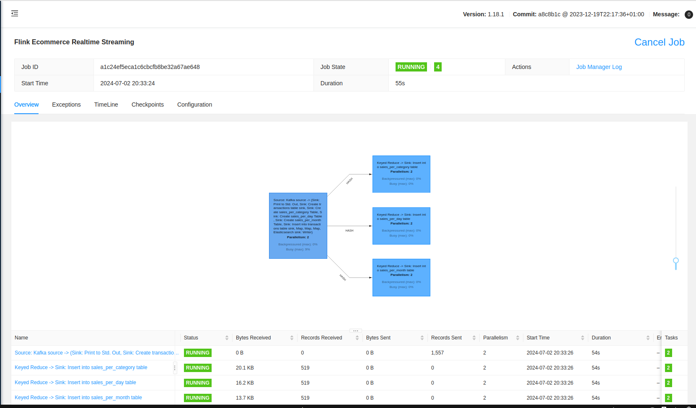
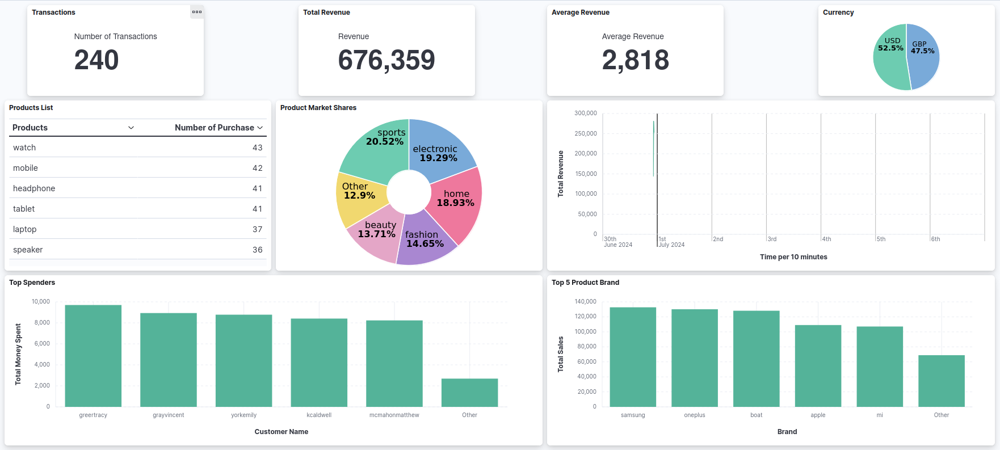
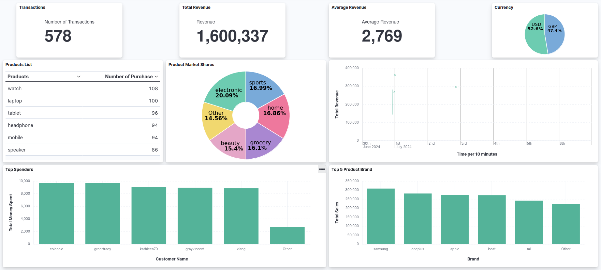

# Apache Flink E-Commerce Analytics with Elasticsearch and Postgres
This repository contains an Apache Flink application for real-time sales analytics. The project demonstrates a real-time data streaming pipeline for e-commerce transactions using Kafka, Flink, PostgreSQL, and Elasticsearch. The pipeline generates synthetic sales transaction data, streams it to Kafka, processes it with Apache Flink, and stores the results in PostgreSQL and Elasticsearch for further analysis and visualization.

## Table of Contents

- [Project Overview](#project-overview)
- [Architecture](#architecture)
- [Components](#components)
- [Prerequisites](#prerequisites)
- [Usage](#usage)
- [Configuration](#configuration)
- [Visualizing the Results](#visualizing-the-results)
- [Project Structure](#project-structure)

## Project Overview

The main objective of this project is to create a real-time data streaming application that processes and stores e-commerce transactions. This project uses the following technologies:

- **Python** for generating synthetic sales transaction data.
- **Kafka** for data streaming.
- **Flink** for real-time data processing.
- **PostgreSQL** for relational data storage.
- **Elasticsearch** for full-text search and analytics.
- **Kibana** for data visualization.

## Architecture

The project architecture consists of several interconnected components:

1. **Data Generator**: Generates synthetic sales transactions and sends them to Kafka.
2. **Kafka**: Serves as the messaging system to stream data.
3. **Flink**: Processes the incoming transaction data and performs various aggregations and transformations.
4. **PostgreSQL**: Stores processed data for relational queries.
5. **Elasticsearch**: Indexes the data for search and analytics.
6. **Kibana**: Provides a dashboard for visualizing the data stored in Elasticsearch.

## Components

#### Apache Flink
- Sets up the Flink execution environment.
- Connects to Kafka as a source for financial transaction data.
- Processes, transforms, and performs aggregations on transaction data streams.
#### PostgresSQL
- Store transaction data and aggregated results in tables (`transactions`, `sales_per_category`, `sales_per_day`, `sales_per_month`)
#### Elasticsearch
- Stores transaction data for furthur analysis.

#### Docker
- Manages the deployment of Kafka, Zookeeper, PostgreSQL, Elasticsearch, and Kibana.

## Prerequisites

- Docker and Docker Compose installed on your machine.
- Java Development Kit (JDK) 11 or higher installed.
- Maven installed for building the Flink job.

## Code Structure
- `DataStreamJob.java`: Contains the Flink application logic, including Kafka source setup, stream processing, transformations, and sinks for Postgres and Elasticsearch.
- `Deserializer`, `Dta`, and `utils` packages: Include necessary classes and utilities for deserialization, data transfer objects, and JSON conversion.

## Usage
1. Ensure all Docker containers are up and running
2. Run the FlinkCommerce application provided in this repository to perform real-time analytics on financial transactions.
3. The Python script (`main.py`) generates and sends synthetic transaction data to the Kafka topic financial_transactions.
4. The Flink job (`DataStreamJob.java`) consumes data from Kafka, processes it, and stores it in PostgreSQL and Elasticsearch.
5. Use Kibana to visualize the data stored in Elasticsearch.

### Getting Started

1. Clone the repository:
   ```bash
   git clone https://github.com/MinhTran1506/ECommerceWithFlink.git
   cd ECommerceWithFlink
2. Install the requirements.txt and start the Docker containers:
    ```bash
    pip install -r requirements.txt
    docker compose up -d
    ```
3. Build the Flink project:
    ```bash
    mvn clean && mvn compile && mvn package
    ```
4. Run the Python data generator:
    ```bash
    python main.py
    ```
5. Submit the Flink job:
    ```bash
    # Replace the path with path to your Apache Flink and .jar mvn file
    /path/to/flink/bin/flink run -c FlinkCommerce.DataStreamJob target/mvn_generated_jar_file.jar
    ```
6. Access Kibana:

    Open your browser and navigate to `http://localhost:5601` to view the Kibana dashboard.

## Configuration

Configuration files for each component are provided:
- `docker-compose.yml`: Configures and manages the Docker containers.
- `kibana.yml`: Configuration for Kibana.
- `pom.xml`: Configureation for Maven project.
- Kafka settings (bootstrap servers, topic, group ID) are configured within the Kafka source setup.
- Postgres connection details (URL, username, password) are defined in the `jdbcUrl`, `username`, and `password` variables.

## Visualizing the Results

#### Flink UI
- Contains all the information about the current Apache Flink stream.


#### Dashboards
- **Dashboard 1**: First dashboard to visualize the data.

- **Dashboard 2**: Dashboard after data is fetch in real-time.


## Project Structure
```css
ECommerceWithFlink/
├── images/
├── src
│   └── main/java
│       ├── Deserializer
│       │   └── JSONValueDeserializationSchema.java
│       ├── Dto
│       │   ├── SalesPerCategory.java
│       │   ├── SalesPerDay.java
│       │   ├── SalesPerMonth.java
│       │   └── Transaction.java
│       ├── FlinkCommerce
│       │   └── DataStreamJob.java
│       └── utils
│           └── JsonUtil.java
├── main.py
├── docker-compose.yml
├── kibana.yml
├── pom.xml
├── README.md
└── requirements.txt
```
- `images/`: Contains all the images of used in the repository.
- `src/main/java`: Contains the Flink streaming job code.
- `main.py`: Python script for generating synthetic sales transactions.
- `docker-compose.yml`: Docker Compose configuration file.
- `kibana.yml`: Configuration for Kibana.
- `pom.xml`: Configurations for Maven Java project.
